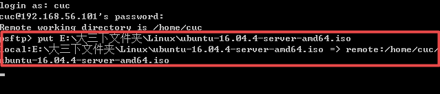
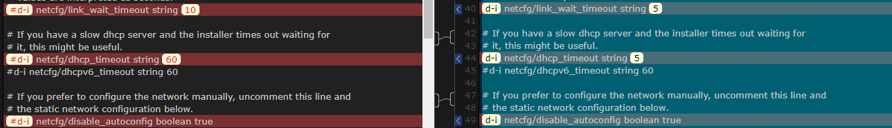

# 无人值守Linux安装镜像制作

## 一、实验要求
1.定制用户名和默认密码

2.定制安装OpenSSH Server

3.安装过程禁止自动联网更新软件包

## 二、实验过程

1.安装Ubuntu系统虚拟机，使用两个网卡，安装opensssh-server


2.按实验指导进行  
- 使用sftp将iso镜像上传到虚拟机内   
  


- 使用putty将光盘内容克隆到工作路径  

```
# 在当前用户目录下创建一个用于挂载iso镜像文件的目录
mkdir loopdir

# 挂载iso镜像文件到该目录
mount -o loop ubuntu-16.04.1-server-amd64.iso loopdir

# 创建一个工作目录用于克隆光盘内容
mkdir cd

# 同步光盘内容到目标工作目录
# 一定要注意loopdir后的这个/，cd后面不能有/
rsync -av loopdir/ cd

# 卸载iso镜像
umount loopdir  
```

- 以上操作后结果  


- 卸载iso镜像
umount loopdir  


- 进入目标工作目录
cd cd/

- 编辑Ubuntu安装引导界面增加一个新菜单项入口
vim isolinux/txt.cfg    


- 添加以下内容到该文件后强制保存退出  
```  
label autoinstall
  menu label ^Auto Install Ubuntu Server
  kernel /install/vmlinuz
  append  file=/cdrom/preseed/ubuntu-server-autoinstall.seed debian-installer/locale=en_US console-setup/layoutcode=us keyboard-configuration/layoutcode=us console-setup/ask_detect=false localechooser/translation/warn-light=true localechoosertranslation/warn-severe=true initrd=/install/initrd.gz root=/dev/ram rw quiet  
```

 

- 使用sftp将定制文件ubuntu-server-autoinstall.seed上传至目录~/cd/preseed/   
 

    

- 修改isolinux/isolinux.cfg，增加内容timeout 10   

    

- 重新生成md5sum.txt   

 
 

- 封闭改动后的目录到.iso.  
```     
IMAGE=custom.iso  
BUILD=~/cd/  
mkisofs -r -V "Custom Ubuntu Install CD" \
            -cache-inodes \
            -J -l -b isolinux/isolinux.bin \
            -c isolinux/boot.cat -no-emul-boot \
            -boot-load-size 4 -boot-info-table \
            -o $IMAGE $BUILD  
            ```  
  

- 最后通过get取出镜像

- 安装结果    


## 三、ubuntu-server-autoinstall.seed与示例文档对比）理解  

左侧为官方文档，右侧为修改后(ubuntu-server-autoinstall.seed)文档

1、 添加多种支持本地支持语言（en，zh），跳过安装时语言支持的设置


2、设置链路等待超时和DHCP超时为5s，选择手动配置网络



3、网络配置

  

4、设置默认主机名，域名。如果有dhcp分配的域名和主机名，直接覆盖。   设置强制主机名，isc-vm-host，不可覆盖。  

  
  

5、定制一个普通用户名和默认密码  

  

6、设置时区，安装期间不实用NTP设置时钟  

  

7、选取最大的空闲空间进行自动分区

  

8、（1） 对于LVM分区方法，选择尽可能多的卷组用于逻辑卷    
（2） 选择分区目录：/home /var/ tmp分离的分区

  

9、不使用网络镜像  

  

10、 （1） server版的安装包  
（2） 预安装openssh-server  
（3） 在debootstrap之后不更新安装包  
（4） 自动安装安全更新

  

## 四、实验后总结  
- 重新生成md5sum.txt时用root权限  
  

- 使用sftp在虚拟机和宿主机之间传输文件时  
```
open <ip-address> # 连接到虚拟机  
get <filename>       # 从虚拟机下载文件到宿主机  
put <filename>       # 从宿主机上传文件到虚拟机    
```  

- 在更改isolinux/txt.cfg文件是将要加入的内容加到文件最前面  

## 参考
[http://sec.cuc.edu.cn/huangwei/course/LinuxSysAdmin/chap0x01.exp.md.html#/6/2](http://sec.cuc.edu.cn/huangwei/course/LinuxSysAdmin/chap0x01.exp.md.html#/6/2)  
[https://github.com/CUCCS/2015-linux-public-songyawen/blob/master/exp1/%E7%AC%AC%E4%B8%80%E6%AC%A1%E5%AE%9E%E9%AA%8C%EF%BC%9A%E6%97%A0%E4%BA%BA%E5%80%BC%E5%AE%88%E5%AE%89%E8%A3%85ubuntu.md](https://github.com/CUCCS/2015-linux-public-songyawen/blob/master/exp1/%E7%AC%AC%E4%B8%80%E6%AC%A1%E5%AE%9E%E9%AA%8C%EF%BC%9A%E6%97%A0%E4%BA%BA%E5%80%BC%E5%AE%88%E5%AE%89%E8%A3%85ubuntu.md)
