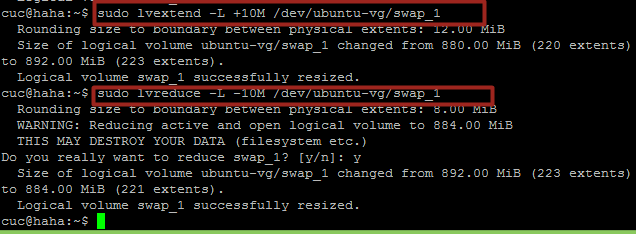

# systemd 学习

## 实验内容
- 命令篇
  - [系统管理](https://asciinema.org/a/kGljqaBi3pW1FZ4jeprBlXobH)
  - [Unit](https://asciinema.org/a/YkQUHoBsL5pVWHXzUSD5GqpAP)
  - [Unit的配置文件](https://asciinema.org/a/qYLHhda9QTtoKf0kxgmzPnpEE)
  - [Target](https://asciinema.org/a/8xVWerXmhViwiXOlL49XPeQFl)
  - [日志管理](https://asciinema.org/a/UCufegol0a8FbnbRlXwcM2aT2)
- 实战篇
  - [基本指令](https://asciinema.org/a/Pw8DcKSZkXuZ6hXXH9SgRk8ex)

## 自查清单
- 如何添加一个用户并使其具备sudo执行程序的权限?  
[链接](https://asciinema.org/a/DhlAzZw7k1w4EH9zYmM3Jzo7j)


- 如何将一个用户添加到一个用户组？    
    
  
  
  

- 如何查看当前系统的分区表和文件系统详细信息？


- 如何实现开机自动挂载Virtualbox的共享目录分区?
  - 1.安装增强功能
  - 2.设置VirtualBox共享的本地文件夹,如E盘下的share，此文件夹中有一个test.txt文件：
  

  - 2.进入Ubuntu系统，创建一个共享目录：
  ```bash
  mkdir /mnt/share
  ```
  - 3.挂载
  ```bash
  mount -t vboxsf share /mnt/share
  ```  
  

  - 4.实现开机自动挂载功能未实现


- 基于LVM（逻辑分卷管理）的分区如何实现动态扩容和缩减容量？  

  


- 如何通过systemd设置实现在网络连通时运行一个指定脚本，在网络断开时运行另一个脚本？
  - 修改networking.service文件，添加两行:
  
  其中，1.sh,2.sh分别为输出一句相应提示信息到test.txt文件
  


- 如何通过systemd设置实现一个脚本在任何情况下被杀死之后会立即重新启动？实现杀不死？
  - 修改该脚本的配置文件[service]部分
  ```bash
  Restart:always
  ```  

