# 第四章：shell脚本编程基础

- 任务一 ：用bash编写一个图片批处理脚本，实现以下功能：  
  - [代码](code/task1)
  - 支持命令行参数方式使用不同功能
  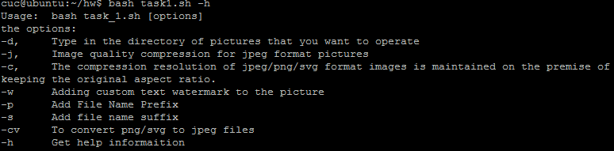
  - 支持对指定目录下所有支持格式的图片文件进行批处理
  - 支持以下常见图片批处理功能的单独使用或组合使用   
    - 支持对jpeg格式图片进行图片质量压缩  
    ```bash  
    bash task1.sh -d image/ -j 30
    ```  
    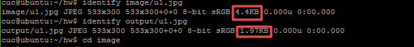
    - 支持对jpeg/png/svg格式图片在保持原始宽高比的前提下压缩分辨率  
    ```bash  
    bash task1.sh -d image/ -c 100  
    ```  
    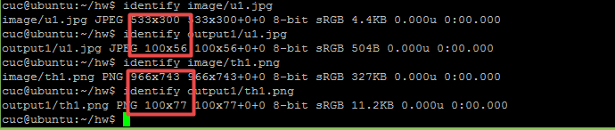
    - 支持对图片批量添加自定义文本水印  
    ```bash  
    bash task1.sh -d image/ -w watermark  
    ```  
    
    
    - 支持批量重命名（统一添加文件名前缀或后缀，不影响原始文件扩展名）  
    ```bash  
    bash task1.sh -d image/ -p th
    bash task1.sh -d image/ -s ing
    ```  
    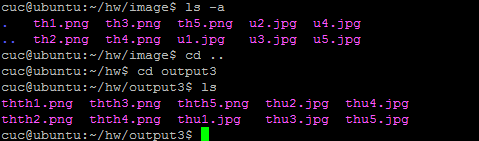  
    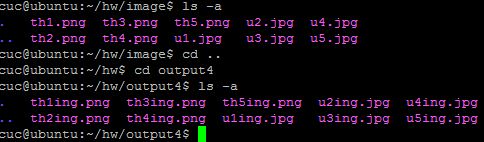
    - 支持将png/svg图片统一转换为jpg格式图片  
    ```bash
    bash task1.sh -d image/ -cv   
    ```  
    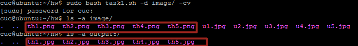


- 任务二：用bash编写一个文本批处理脚本，对以下附件分别进行批量处理完成相应的数据统计任务:  
  - [代码](code/task2)
  - 帮助信息  
  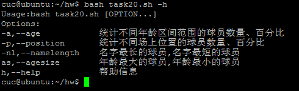  
  - 统计不同年龄区间范围（20岁以下、[20-30]、30岁以上）的球员数量、百分比  
  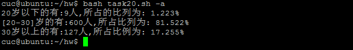    
  - 统计不同场上位置的球员数量、百分比  
    
  - 名字最长的球员是谁？名字最短的球员是谁？  
  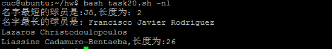  
  - 年龄最大的球员是谁？年龄最小的球员是谁？  
    


- 任务二：用bash编写一个文本批处理脚本，对以下附件分别进行批量处理完成相应的数据统计任务：  

  - [代码](code/task3)
  -  帮助信息  
  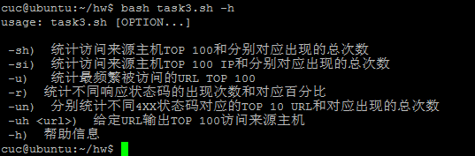
  -  统计访问来源主机TOP 100和分别对应出现的总次数  
  ```bash  
  bash task3.sh -sh  
  ```    
  [输出文本](sh.txt)
  -  统计访问来源主机TOP 100 IP和分别对应出现的总次数    
  ```bash  
  bash task3.sh -si  
  ```   
  [输出文本](si.txt)
  -  统计最频繁被访问的URL TOP 100   
  ```bash  
  bash task3.sh -u  
  ```   
  [输出文本](u.txt)
  -  统计不同响应状态码的出现次数和对应百分比   
  ```bash  
  bash task3.sh -r  
  ```   
  [输出文本](r.txt)
  -  分别统计不同4XX状态码对应的TOP 10 URL和对应出现的总次数  
  ```bash  
  bash task3.sh -un  
  ```    
  [输出文本](un.txt)
  -  给定URL输出TOP 100访问来源主机  
  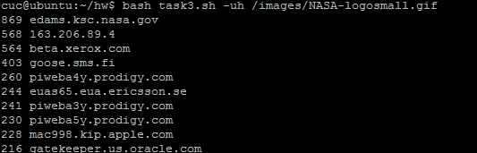


  ## 参考
  [convert](https://blog.csdn.net/u011944141/article/details/51658012)  
  [awk](https://blog.csdn.net/f8cncn/article/details/53533463)  
[同学作业](https://github.com/CUCCS/2015-linux-public-JuliBeacon/blob/master/%E5%AE%9E%E9%AA%8C%204/Code/Task_1.sh)
