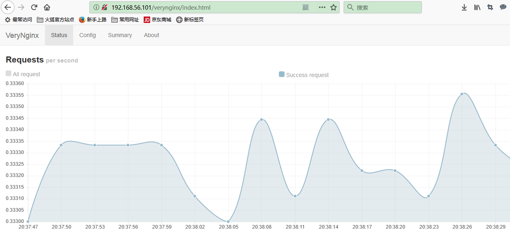
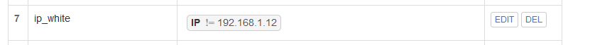

## 实验名称
- web服务器配置

## 实验环境
- server1
  - ubuntu 16.04 (host only网卡：192.168.56.101)
  - verynginx(port:80)
  - nginx(port:8080)
- server2
  - ubuntu 16.04(host only网卡：192.168.56.103)
  - wordpress

- 安装配置nginx和verynginx
  - 安装nginx
```
sudo apt install nginx
```
  - 配置nginx为8080端口
   参考：[https://blog.csdn.net/w20101310/article/details/78835668](https://blog.csdn.net/w20101310/article/details/78835668)
  - 安装verynginx
  ```bash
git clone https://github.com/alexazhou/VeryNginx.git
#安装Python
sudo update-alternative --install /usr/local/bin/python python /usr/bin/python3 10
sudo apt install libpcre3 libpcre3-dev libssl-dev build-essential
#执行sudo python install.py install在Verynginx目录下
sudo python install.py install
#将/opt/verynginx/openresty/nginx/conf/nginx.conf文件第二行改为user www-data
#启动服务
sudo /opt/verynginx/openresty/nginx/sbin/nginx
  ```
  - 在一台主机上同时配置nginx和verynginx完成
  
  
  

- 安装配置WordPress
  - [安装LAMP](https://www.digitalocean.com/community/tutorials/how-to-install-linux-apache-mysql-php-lamp-stack-on-ubuntu-16-04)

  - [安装WordPress](https://www.digitalocean.com/community/tutorials/how-to-install-wordpress-with-lamp-on-ubuntu-16-04)
  - 安装成功
  

  - 使用Wordpress搭建的站点对外提供访问的地址为： https://wp.sec.cuc.edu.cn 和 http://wp.sec.cuc.edu.cn
    - client 修改hosts文件
    
    - http
    
    - https
      - [ssl](https://www.digitalocean.com/community/tutorials/how-to-create-a-self-signed-ssl-certificate-for-apache-in-ubuntu-16-04)
    
 - 用域名时出现问题：访问wp.sec.cuc.edu.cn时显示的是域名，登录wordpress后显示ip地址。问题未解决。
 
 
  - DVWA未安装成功


### 实验要求
#### 设置反向代理
- verynginx配置
  - matcher
  
  - proxy pass
  


- 配置未生效

#### 安全加固要求
- verynginx设置Matcher匹配，Response响应和Filter过滤
- 使用IP地址方式均无法访问上述任意站点，并向访客展示自定义的友好错误提示信息页面-1
  - matcher
  
  - response
  
  - filtre
  

 - 配置完后出现问题，删掉配置文件相应的配置，重新配置  
  
  
- 在不升级Wordpress版本的情况下，通过定制VeryNginx的访问控制策略规则，热修复WordPress < 4.7.1 - Username Enumeration
  - matcher
  
  - response
  
  - filter
  

#### verynginx配置要求
- VeryNginx的Web管理页面仅允许白名单上的访客来源IP，其他来源的IP访问均向访客展示自定义的友好错误提示信息页面-3
  - matcher
  
  - response
  
  - filter
  

- 通过定制VeryNginx的访问控制策略规则实现：
  - 限制DVWA站点的单IP访问速率为每秒请求数 < 50
  - 限制Wordpress站点的单IP访问速率为每秒请求数 < 20
    - freqency limit
    
  - 超过访问频率限制的请求直接返回自定义错误提示信息页面-4
  

  - 禁止curl访问
    - matcher
    
    - filter
    
