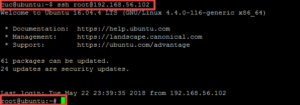
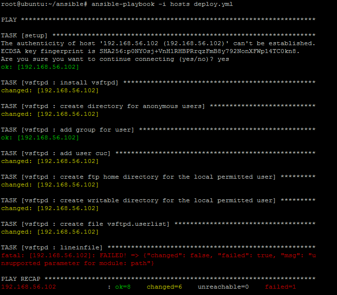
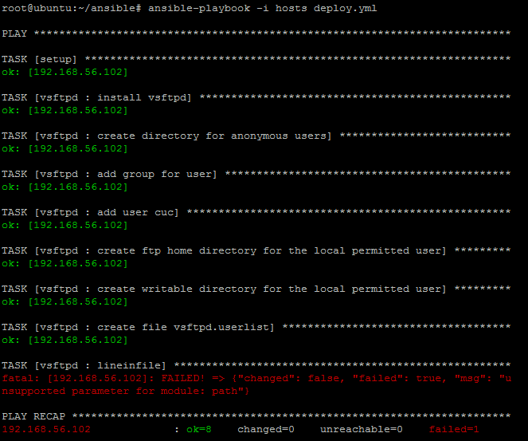

## 实验报告7
## 实验名称
- 使用ansible技术重构FTP、NFS、DHCP、DNS、Samba服务器的自动安装与自动配置

## 实验过程
- root免密登录  
[参考连接](https://blog.csdn.net/sinat_35820101/article/details/78393088)  

- [配置文件](ansible)

- 运行结果  

- 红色出错出现一个错误，未修改成功。
